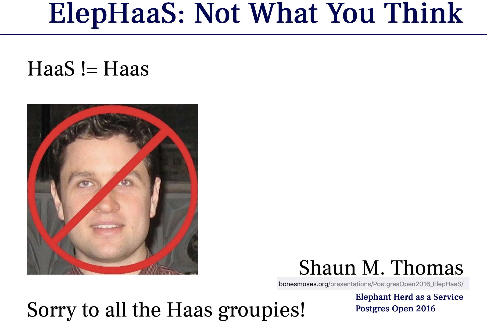
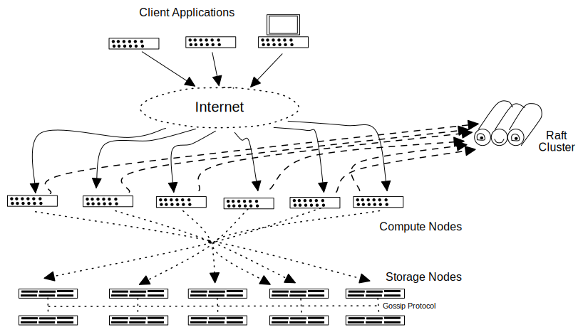
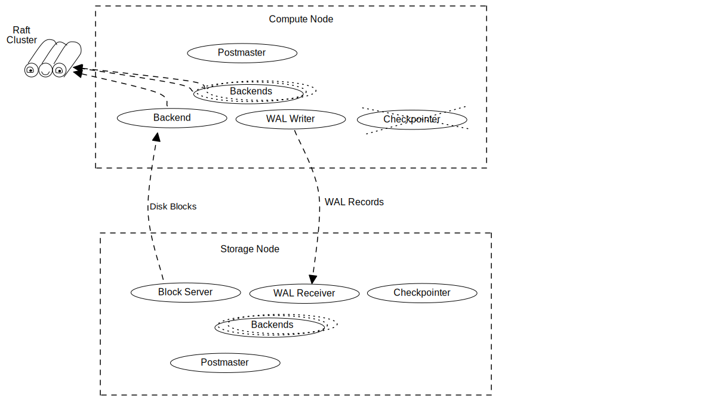

---
# reveal-md options

title: HaaS Architecture        # Used as title of HTML page
author: Gurjeet Singh

# RevealJS options
revealOptions:
  center: false                 # Don't center slides vertically
  slideNumber: true             # Show slide numbers
  controlsTutorial: false       # Don't bounce the distracting arrow controls
  pdfSeparateFragments: false   # When printing, don't create slides for every fragment
---

<head>
  <!-- Use reveal-md for presentation -->

<!--  --> 
  <!-- styles to be applied to all slides -->
  

</head>

<!-- Center this slide vertically
     .slide: class="center"        -->

HaaS Architecture
=================

 gurjeet      

 @supabase.io 

 @singh.im    

---

Ideal Features of a PGaaS
-------------------------

- Postgres Compatibility               <!-- .element: class="fragment" -->
- Synchronized Releases with Community <!-- .element: class="fragment" -->
- Point-in-Time Recovery               <!-- .element: class="fragment" -->
- Automatic Daily Backups              <!-- .element: class="fragment" -->
- Manual/Named Backups                 <!-- .element: class="fragment" -->
- Database Instance Branches/Clones    <!-- .element: class="fragment" -->
- Encryption-at-Rest                   <!-- .element: class="fragment" -->

Notes: 
- Postgres Compatibility
  - Network Protocol
  - SQL Commands
  - Extensions
  - Bugs
- Synchronized Releases with Community
  - Regular code merges (perhaps every commit)
- Point-in-Time Recovery
  - Ability to create a clone from an arbitrary time in past
- Automatic Daily Backups
- Manual/Named Backups
- Database Instance Branches/Clones
  - Ability to create lightweight clones
  - Similar to Filesystems Snapshots in ZFS, etc.
- Encryption-at-Rest

---

Ideal Features (contd.)
-----------------------

- Online Storage Auto-Scaling           <!-- .element: class="fragment" -->
- Online Compute (and RAM) Auto-Scaling <!-- .element: class="fragment" -->
- Online Version Upgrades               <!-- .element: class="fragment" -->
- Scale-to-Zero                         <!-- .element: class="fragment" -->
- Ability to Throttle IOPS              <!-- .element: class="fragment" -->
- Offline Support                       <!-- .element: class="fragment" -->

Notes: 
- Online Storage Auto-Scaling
  - Add/remove Storage Nodes
  - Increase/decrease Storage Capacity
  - Increase/decrease Storage Bandwidth
- Online Compute (and RAM) Auto-Scaling
  - Add/remove Compute Nodes
  - Increase/decrease CPU Speed
- Online Version Upgrades
- Scale-to-Zero

  Ability to turn off all Compute Nodes, when clients are not active.

- Ability to Throttle IOPS

  In multi-tenant environments, one tenant is **not** able to overwhelm the I/O
and network bandwidth, hence is not able to impact the performance of other
tenants' DB Instances.

- Offline Support
  - Provides multi-master replication
  - Postgres running on mobile/disconnected devices
  - Provides conflict-resolution strategies

---

HaaS
-----

- An attempt at implementing the ideal features
- Haathi-as-a-Service
  - Haathi: 'Elephant', [in Hindi][elephant-in-hindi]

[elephant-in-hindi]: https://www.collinsdictionary.com/dictionary/hindi-english/%E0%A4%B9%E0%A4%BE%E0%A4%A5%E0%A5%80

---

Obligatory Denial
-----------------

<!-- Using HTML, instead of Markdown, to control image size -->

---

Research
--------

- Investigated various open-source projects
- Read about various products (commercial and open-source)
- Compared their architectures
- Brainstormed ideas and architectures
- Proposed architecture chosen after considering many others

---

Research (Contd.)
-----------------

  - Postgres-XC (Postgres-XL, Tbase)
  - Postgres on OpenEBS (userland OpenZFS)
  - Amazon Aurora
  - CitusDB, bought by Microsoft
  - PolarDB, by Alibaba
  - Oracle Exadata, Oracle RAC
  - Google Spanner
  - TimescaleDB
  - Modify an open-source iSCSI driver to do ***our*** thing
  - ... others I may be forgetting

---

Warning
-------

- This is a Moonshot Project

  Inspired after seeing Google Spanner demo

  Quote: *... if we're aiming for the moon, I think we should aim to be more like Google Spanner, rather than try to emulate Amazon Aurora.*

  from the email to @copple, @ant, and @inian.

- The implementation details are hand-wavy as of now

Notes:

While 'moonshot' originally meant "long shot," it's increasingly being used to
describe a monumental effort and a lofty goal—in other words, a "giant leap."
(from [Merriam-Webster dictionary][moonshot])

[moonshot]: https://www.merriam-webster.com/words-at-play/moonshot-words-were-watching

---

HaaS Architecture in a _Nutshell_
----------------------------------

- One or more Postgres primary DB Instances
 - Compute Nodes
- One or more Postgres standby DB Instances
 - Storage Nodes
- Compute Nodes send Write-Ahead Log (WAL) to Storage Nodes
- Compute Nodes do ***not*** write to local filesystem
- Compute Nodes read blocks from Storage Nodes

---

HaaS Arch. in a Thousand Words
------------------------------

---

HaaS Arch. Drilldown
--------------------

---

HaaS Architecture - More Details
--------------------------------

- A Raft protocol based Lock Manager
  - External Lock Manager (ELM)
- Compute Nodes use ELM to take shared or exclusive locks on blocks
- No need to consult ELM when there's just one Compute Node

Notes:
- Alternatives if Raft is found to be unsuitable
  - MESI protocol (or others) from CPU architectures
  
---

More Details (Contd.)
----------------------

- The Storage Nodes
  - use a Gossip protocol to communicate w/ each other
  - take ownership of 1GB-sized segments
  - forward relevant WAL records to peers
  - ensure Durability (from ACID) guarantee

---

A Note About Performance
------------------------

- Correctness above speed/performance        <!-- .element: class="fragment" -->
- Performance is an invisible feature        <!-- .element: class="fragment" -->
- There are only 2 kinds of databases        <!-- .element: class="fragment" -->
  - the ones that have great features, and   <!-- .element: class="fragment" -->
  - the ones that are used by the customers. <!-- .element: class="fragment" -->

---

A Note About Perf. (Contd.)
---------------------------

- The single-node MVP version's performance
  - should be comparable to Postgres
    - on same or similar hardware, or
    - on different hardware, but at the same price-point
  
---

Milestone 1
-----------

- Modify Postgres to:
  - make it use a standby for all data/files
  - serve read requests made by compute node
---

Milestone 1 - Evaluation Criteria
---------------------------------

- Successfully run pgbench
  - in read-write mode
  - with single client connection
  - for at least 60 seconds
  - that completes at least 1 transaction
  - with 0 errors

---

Future
------

#### (waa..y into the future)

- Predicate/Aggregate push-down to Storage Nodes
  - process WHERE clause closer to storage
  - process GROUP BY clause closer to storage
- Leverage RDMA
  - RDMA in Cloud becoming a reality
  - Amazon EC2 Elastic Fabric Adapter (EFA) 

---

<!-- Center this slide vertically
     .slide: class="center"        -->

Questions/Comments
------------------

 gurjeet      

 @supabase.io 

 @singh.im    

